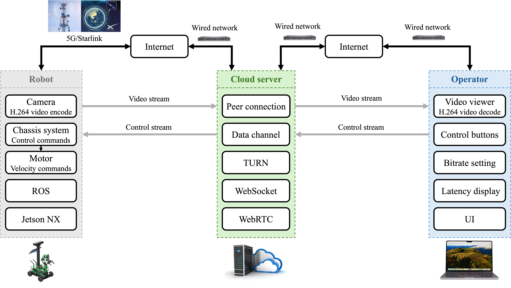

# GloControl

## GloControl: Global Teleoperation of Robots for Disaster Response Using WebRTC over Internet

#### [[Paper]](https://)

[[Chao He]](https://scholar.google.com/citations?user=g4Yv3BkAAAAJ&hl=en) and [[Da Hu]](https://scholar.google.com/citations?user=Y7_j-GMAAAAJ&hl=en&oi=ao) 

Kennesaw State University

This is the project page for [[Paper]](https://)

Global teleoperation of robots in disaster response scenarios demands low-latency, infrastructure-independent communication capable of functioning without local network infrastructure, which is often destroyed or unavailable at disaster sites. Existing teleoperation systems rely on specialized hardware, VPN tunnels, or dedicated servers, and few formally characterize end-to-end latency under real-world conditions. In this paper, we present GloControl, a WebRTC-based system that unifies live video feedback and motion control commands within a single WebRTC session via the Janus media server, leveraging the WebRTC data channel for real-time robot control. By utilizing WebRTC's built-in NAT traversal via ICE, STUN, and TURN, the system is operable from anywhere on Earth where Internet connectivity is available via 5G or LEO satellite networks such as Starlink, requiring only a standard web browser on the operator side. We deploy and evaluate GloControl on a Yahboom Rosmaster-X3-Plus robot equipped with a NVIDIA Jetson NX, and characterize end-to-end latency across seven test configurations spanning operator, cloud server, and robot locations across China and the United States, including an intercontinental link of 13,327 km. Control latency, measured via a ping-pong scheme over the WebRTC data channel, ranges from 133 ms (same-city) to 283 ms (intercontinental), and end-to-end video latency is 183 ms (same-city) and approximate 330 ms (intercontinental). Cloud server placement is identified as the dominant latency design variable, and a Seattle-based server is shown to outperform Hong Kong and Tokyo servers for China-to-USA teleoperation. These results confirm the feasibility of WebRTC over 5G and Starlink as a viable transport for real-time disaster response robot teleoperation deployable where fixed network infrastructure cannot be assumed.

<div align="center">
  <br>
  <strong>Figure 1.</strong> Complete System Workflow.
</div>
<br><br>


<div align="center">
  <br>
  <strong>Figure 2.</strong> The Setup of the Data Collection (note: for visualization purposes, the LiDAR sensors appear closer together in this photograph than their actual deployment configuration. The operational sensor separation during data collection is 24 meters; photographing at true scale would render the individual sensors too small to distinguish clearly.).
</div>
<br><br>


<div align="center">
  <br>
  <strong>Figure 3.</strong> Background Filtering (the foreground object is an excavator.).
</div>
<br><br>

<div align="center">
  <br>
  <strong>Figure 4.</strong> Background Reconstruction in Bird’s Eye View.
</div>
<br><br>

<div align="center">
  <br>
  <strong>Figure 5.</strong> Bird's Eye View Visualization of Entire Construction Site (red: left LiDAR, blue: right LiDAR).
</div>
<br><br>

<div align="center">
  <br>
  <strong>Figure 6.</strong> Details of Objects after Automatic Alignment (red: left LiDAR, blue: right LiDAR).
</div>
<br><br>

<div align="center">
  <br>
  <strong>Figure 7.</strong> Bird's Eye View of Results for Single-LiDAR System (Left) and Dual-LiDAR system (Right) (red: excavator, green: worker).
</div>
<br><br>


## 1. Data
**Data** : 
[[bin]](https://github.com/Saturn-Chao-He/dual-LiDAR-object-detection/tree/main/bin)

## 2. Environment (Ubuntu 20.04, ROS 1 Noetic)

Create Python environment and install the required packages:
```bash
conda env create -f dual.yaml
conda activate dual

```

## 3. Ternimal 1
Run
```bash
export DISABLE_ROS1_EOL_WARNINGS=1
source /opt/ros/noetic/setup.bash
roscore
```

## 4. Ternimal 2
Run
```bash
rviz -d detect.rviz -f velodyne
```

## 5. VSCode
Run
```bash
# conda env: dual
export DISABLE_ROS1_EOL_WARNINGS=1
source /opt/ros/noetic/setup.bash
python detect.py
```


## Acknowledgement
Great thanks to the Q building of Kennesaw State University.

## Cite
If this project is useful in your research, please cite:
> He, C., & Hu, D. (2026). Dual-LiDAR Point Cloud Fusion with Automatic Alignment for Enhanced 3D Object Detection in Construction Site Environments.

Related paper:
> He, C., & Hu, D. (2026). A LiDAR-Driven Framework for Real-Time Monitoring and Speed Tracking on Construction Sites.

