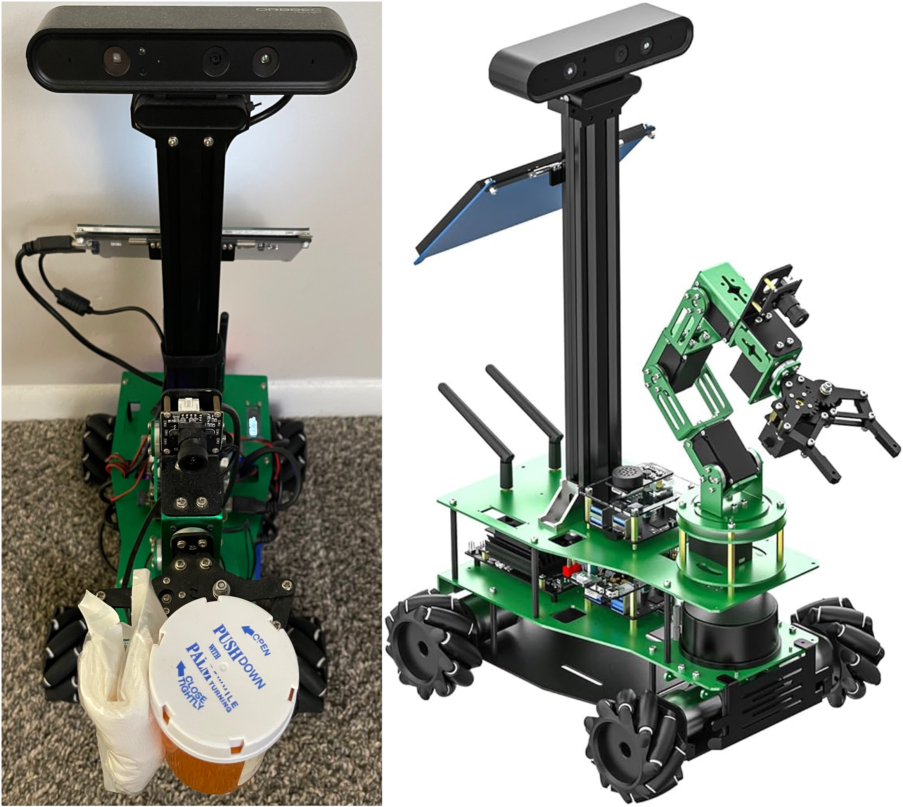
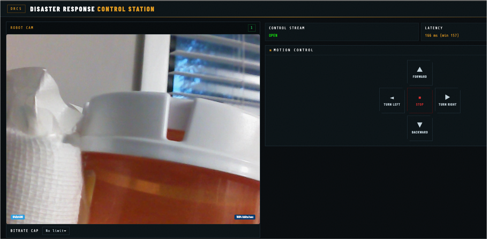
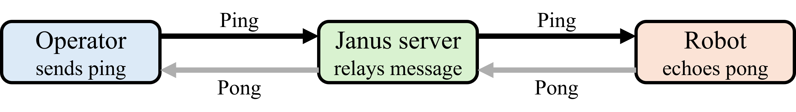
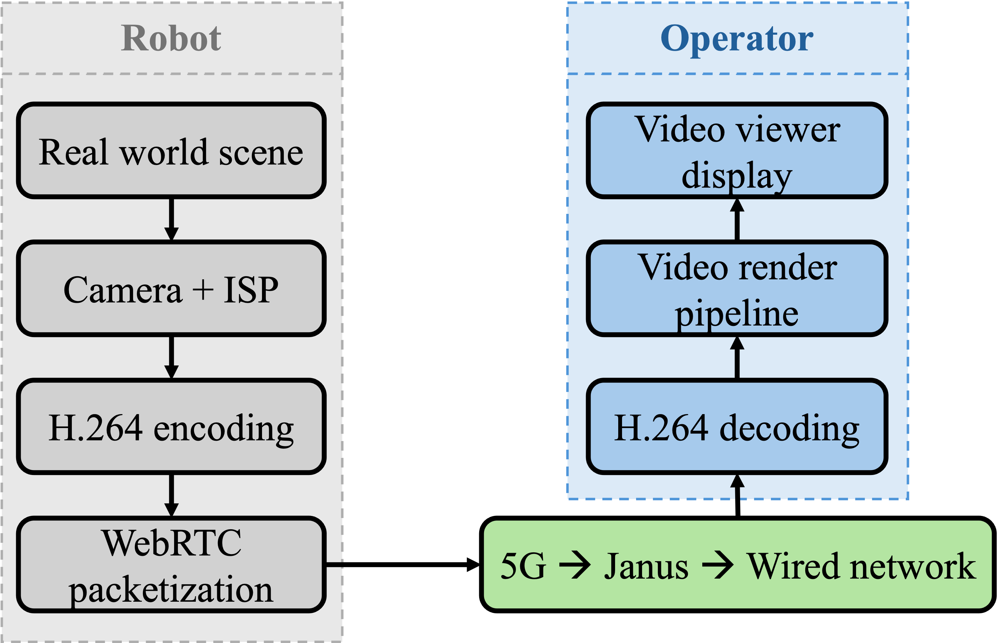
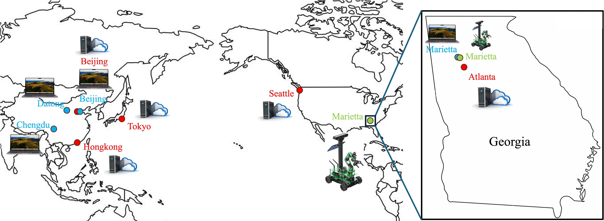
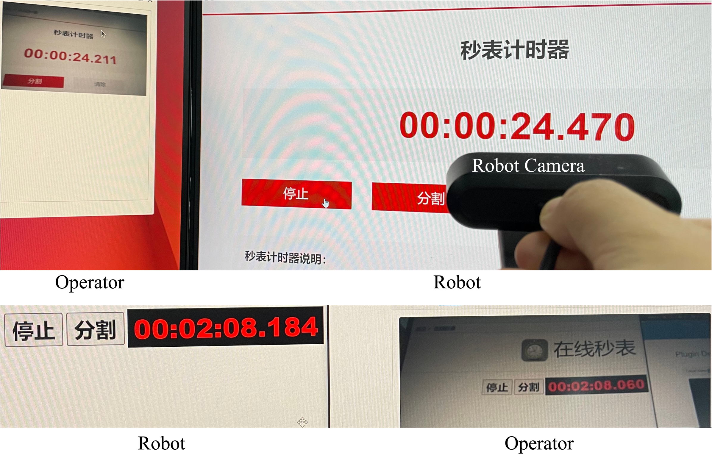

# GloControl

## GloControl: Global Teleoperation of Robots for Disaster Response Using WebRTC over Internet

#### [[Paper]](https://)

[[Chao He]](https://scholar.google.com/citations?user=g4Yv3BkAAAAJ&hl=en) and [[Da Hu]](https://scholar.google.com/citations?user=Y7_j-GMAAAAJ&hl=en&oi=ao) 

Kennesaw State University

This is the project page for [[Paper]](https://)

Global teleoperation of robots in disaster response scenarios demands low-latency, infrastructure-independent communication capable of functioning without local network infrastructure, which is often destroyed or unavailable at disaster sites. Existing teleoperation systems rely on specialized hardware, VPN tunnels, or dedicated servers, and few formally characterize end-to-end latency under real-world conditions. In this paper, we present GloControl, a WebRTC-based system that unifies live video feedback and motion control commands within a single WebRTC session via the Janus media server, leveraging the WebRTC data channel for real-time robot control. By utilizing WebRTC's built-in NAT traversal via ICE, STUN, and TURN, the system is operable from anywhere on Earth where Internet connectivity is available via 5G or LEO satellite networks such as Starlink, requiring only a standard web browser on the operator side. We deploy and evaluate GloControl on a Yahboom Rosmaster-X3-Plus robot equipped with a NVIDIA Jetson NX, and characterize end-to-end latency across seven test configurations spanning operator, cloud server, and robot locations across China and the United States, including an intercontinental link of 13,327 km. Control latency, measured via a ping-pong scheme over the WebRTC data channel, ranges from 133 ms (same-city) to 283 ms (intercontinental), and end-to-end video latency is 183 ms (same-city) and approximate 330 ms (intercontinental). Cloud server placement is identified as the dominant latency design variable, and a Seattle-based server is shown to outperform Hong Kong and Tokyo servers for China-to-USA teleoperation. These results confirm the feasibility of WebRTC over 5G and Starlink as a viable transport for real-time disaster response robot teleoperation deployable where fixed network infrastructure cannot be assumed.

   
  <strong>Figure 1.</strong> GloControl system architecture. The robot streams H.264 video and receives motion commands through a cloud-hosted Janus WebRTC server over theInternet. The operator requires only a standard web browser. Internet connectivity can be provided by 5G or Starlink, enabling operation in infrastructure-denied disaster environments.

  

   
  <strong>Figure 2.</strong> Disaster response robot is holding medicine and gauze and ready to deliver.

  

   
  <strong>Figure 3.</strong> GloControl operator interface. (Left: live video  from the robot camera and bitrate cap control. Right: motion control buttons and real-time control latency display.)

  

   
  <strong>Figure 4.</strong> RTT ping-pong scheme over the data channel.

  

   
  <strong>Figure 5.</strong> The pipeline of video stream processing and transmission.

  

   
  <strong>Figure 6.</strong> Cities on the map in this experiment. (blue: operator, red: cloud server, green: robot.)

  

   
  <strong>Figure 7.</strong> End-to-end highest latency and lowest latency for video reviewer in the same city (T7). (up: highest 259 ms, bottom: lowest 124 ms, mean: 183 ms.)

  

## Acknowledgement
Great thanks to Kennesaw State University and NSF. This work was supported by the National Science Foundation (NSF) under Grant No. 2346936.

## Cite
If this project is useful in your research, please cite:
> He, C., & Hu, D. (2026). GloControl: Global Teleoperation of Robots for Disaster Response Using WebRTC over Internet.
